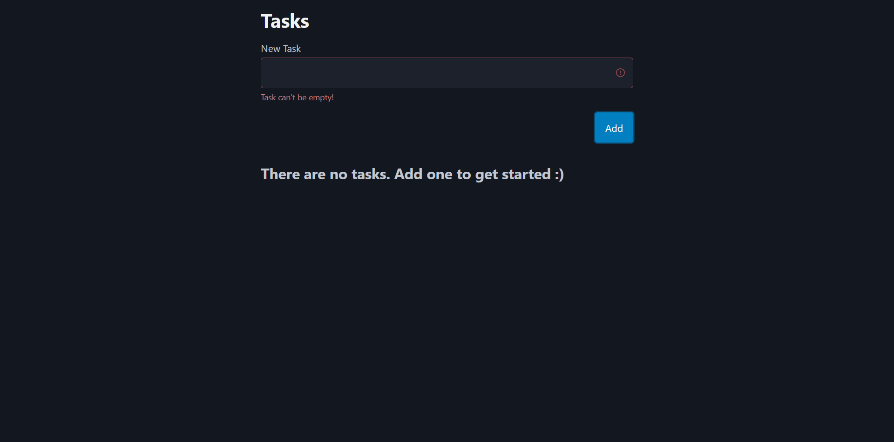
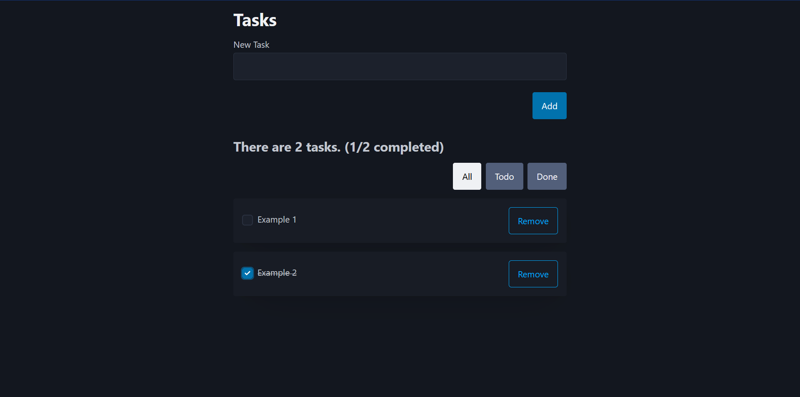

# Tasks app

This project is made with **Laravel** and **Vue3**, using **MySQL** database.
Keeping track of all tasks - write them down, check them when finished or just simply delete

## Demo of an app

Screenshots:

## How to get started

1. Clone the repository
2. Install all dependencies for backend(Laravel) and frontend(Vue)
3. Run the app... `php artisan serve` || `npm run dev`
